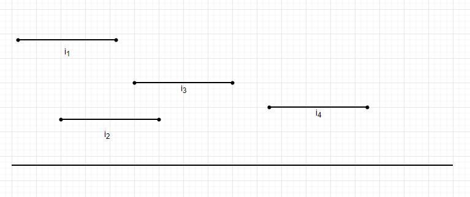

# 📝 区间调度

## 题目描述

给你很多形如 `[start, end)` 的区间，请你设计一个算法，算出这些区间中最多有几个互不相交的区间。

```java
int intervalSchedule(int[][] intvs) {
    // TODO
}
```

<figure><figcaption><p>区间调度问题</p></figcaption></figure>

## 解题思路

首先应该接受最先完成的请求，确保资源尽快可用，同时仍然可以满足一个请求。这样使剩余时间最大化，以此来满足其他请求。

1. 先为请求按照结束时间进行升序排序。
2. 接受第一个请求，将total记为1。
3. 对余下的请求进行判定，如果和上个被接受的请求相容，则`total+1`。

## 算法实现

<pre class="language-java" data-title="Solution.java" data-overflow="wrap" data-line-numbers><code class="lang-java">private static final Comparator&#x3C;int[]> COMPARATOR = Comparator.comparingInt(ls -> ls[1]);
<strong>
</strong>public int intervalSchedule(int[][] intvs) {
    if (intvs == null || intvs.length == 0) {
        return 0;
    }
    Arrays.sort(intvs, COMPARATOR);
    int total = 1; // 最大相容区间数
    int currentEndPoint = intvs[0][1]; // 当前相容集最大结束时间点
    for (int[] interval : intvs) {
        if (interval[0] >= currentEndPoint) { // 相容
            total++;
            currentEndPoint = interval[1];
        }
    }
    return total;
}
</code></pre>

## 总结

区间调度问题中，每个请求的权重都是一样的。另外，对于调度器而言，所有的请求都是静态的，一开始就了解所有的请求。

算法的核心步骤在于最开始的排序，这定义了最小结束时间优先的贪心策略。
